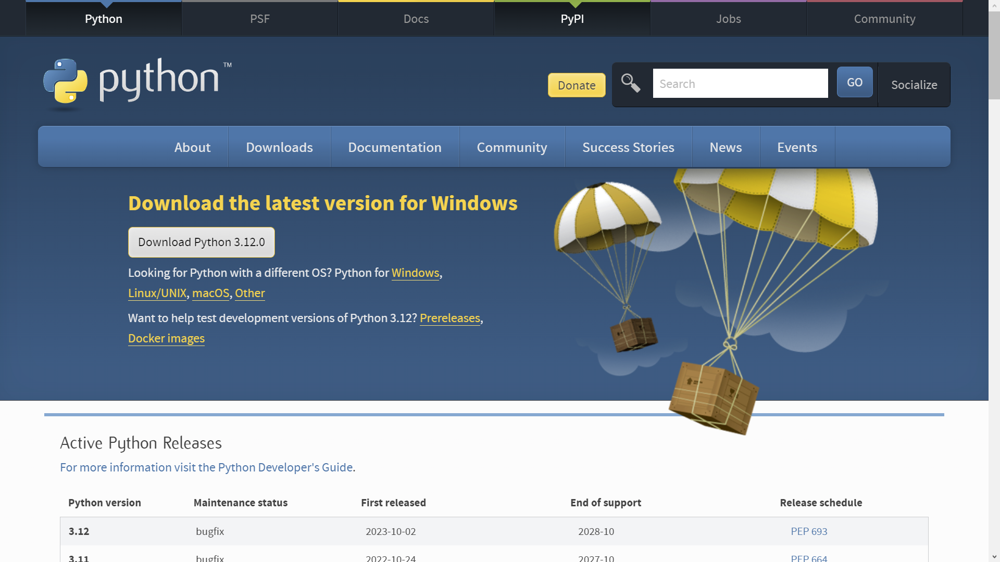
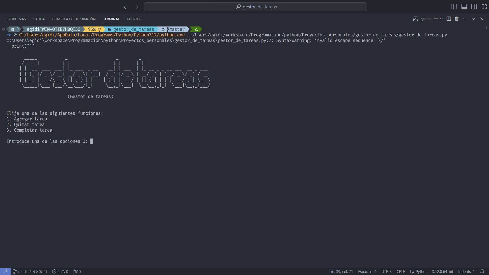
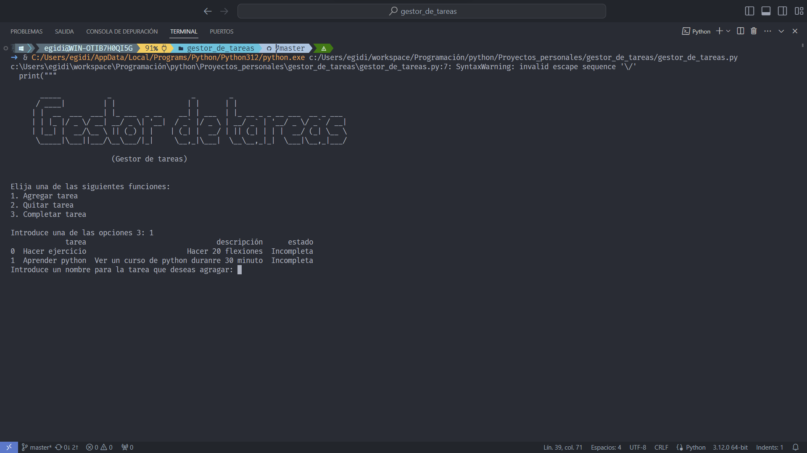
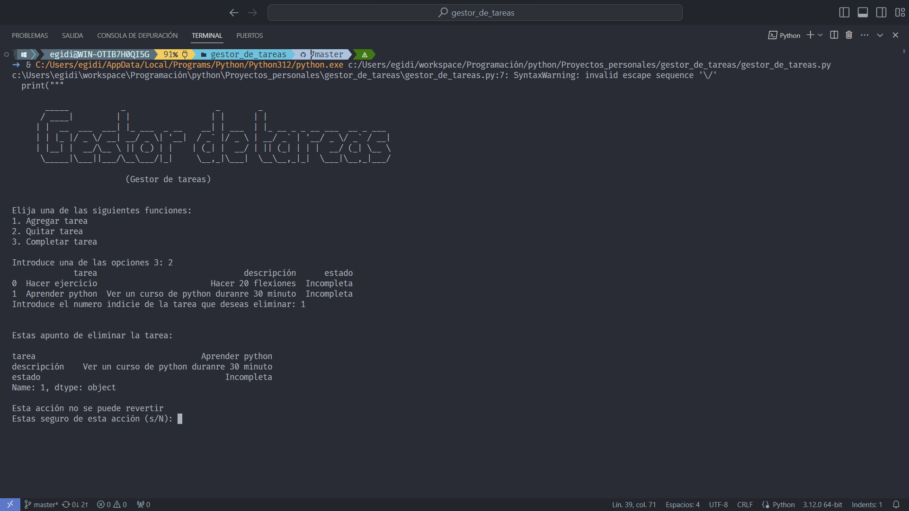
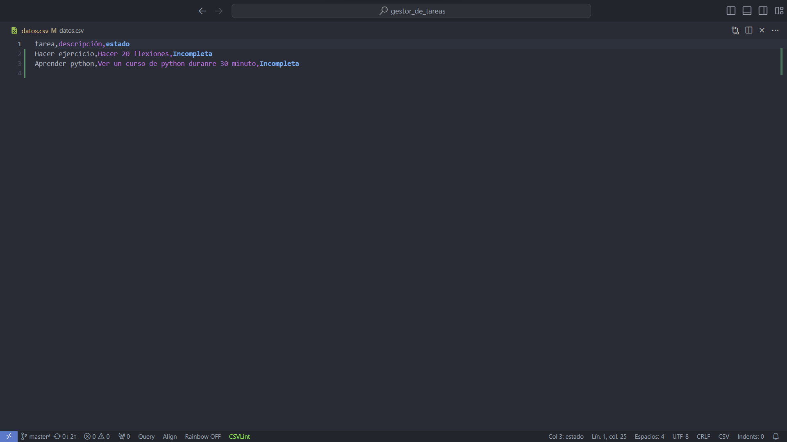

# Gestor-de-tareas
***
## Descripción

Este es un gestor de tareas que guarda las tareas en un archivo csv para que puedas a organizarte de mejor manera.

***

### Tecnologias usadas para crear el programa
* Lenguaje de programación Python.
* Libreria Pandas.

***
## Requisitos
Para usar el programa solo debes tener instaladas las siguientes cosas:
1. Debes tener instalado Python en tu computadora.
2. Debes tener instalada la libreria de pandas.
___

### Como descargar Python
#### En windows:
Para descargar Python en windows debes ir al la [web oficial](https://www.python.org/downloads/) de python y descargar un archivo ejecutable.

Una vez que descargues el archivo .exe deberas ejecutarlo e instalar python.

#### En macOS:
Hay varias formas de descargar Python en macOS
1. **Desde la web oficial**: Puedes descargar Python llendo a la [web oficial](https://www.python.org/downloads/) y descargar un ejecutable para despues proceder con la instalación.
    2. **Hombrew**: Tambien puedes descargar Python con el gestor de paquete Homebrew.
Para instalar Python con Hombrew deberas ejecutar el siguiente comando:  
`brew install python`

#### En linux:
Por lo general python ya viene instalado en linux pero si no es así deberas instalarlo de una de las siguientes maneras:
1. **Desde la web oficial**: Puedes ir a la [web oficial de python](https://www.python.org/downloads/) y descargar el ejecutable.exe.
Una vez descargado, usted debe proceder con la instalación de python
2. **Descargar Python desde la terminal**: Puede instalar python desde la terminal con un gestor de paquetes. Pero los comandos cambiaran dependiendo de su distribución y del gestor de paquetes que usted posea.

Si usted tiene:
- Ubuntu 
- Debian
- Zorin OS
- Mint Linux
- Elementary OS
- Bodhi Linux
- MX Linux
- Lite Linux
- LUbuntu
- POP! OS
- Deepin
- Kali Linux

El siguiente comando le deberia de funcinar `sudo apt-get install python3`

Si usted tiene:

- Arch Linux
- Manjaro
- EndeavourOS
- Parabola
- Frugalware
- Chakra

El siguiente comande deberia funcionarle
`sudo pacman -S python`

Si usted tiene
- Fedora
- Red Het Enterprice Linux
- Oracle Enterprice Linux
- OpenSUSE

El siguiente comando le deberia funcionar 
`sudo dnf install python3`

***
### Como descargar la libreria pandas
Una vez descargado python puede instalar pandas con el gestor de paquetes pip que funciona en Windows, MacOS y linux.

Primero debera tener instalado el gestor de paquetes pip.

Luego ejecute el siguiente comando en una terminal `pip install pandas` ahora deberia tener instalado pandas en su sistema
***
## Instrucciones de uso
Para agragar una tarea escriba 1 en la siguiente sección

Tambien ahi se le explica como eliminar y completar tareas.

El programa es muy intuitivo aunque no tenga interfaz grafica.
***
## Imagenes de como se ve el programa

***

***

***
## Contacto
Cualquier pregunta o sugerencia puede contactar al siguiente correo electronico egidiocontacto11@gmail.com